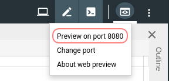

# Access your cluster

During the tutorial we are going to access the cluster via HTTP.

The Cloud Shell provides a proxy that allows us access to the resources in your Kubernetes cluster.

1. Execute the commnad `kubectl proxy --port 8080`. This will open a HTTP proxy to your cluster:
   ```
   Starting to serve on 127.0.0.1:8080
   ```
2. Access your cluster using the preview functionality of Cloud Shell:
   
3. This will open a new tab with an URL like `https://8080-dot-7136354-dot-devshell.appspot.com/path`.
   Paste the URL without path into the following field, it will customize the tutorial:<br>
   <input id="gcloud-shell-url" style="width:400px"> <button id="gcloud-shell-url-apply">Apply</button><br>
4. Test [this link]($GCLOUD_SHELL_URL/version) to verify the proxy is set up correctly. You should see a JSON response:
   ```json
   {
     "major": "1",
     "minor": "11+",
     "gitVersion": "v1.11.8-gke.6",
     "gitCommit": "394ee507d00f15a63cef577a14026096c310698e",
     "gitTreeState": "clean",
     "buildDate": "2019-03-30T19:31:43Z",
     "goVersion": "go1.10.8b4",
     "compiler": "gc",
     "platform": "linux/amd64"
   }
   ```
