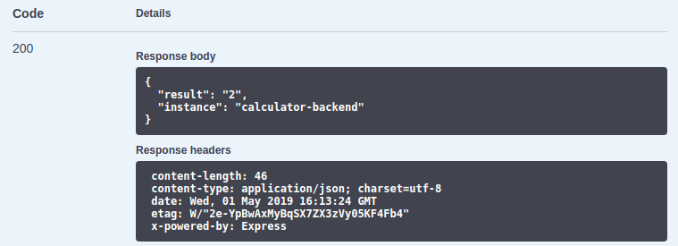
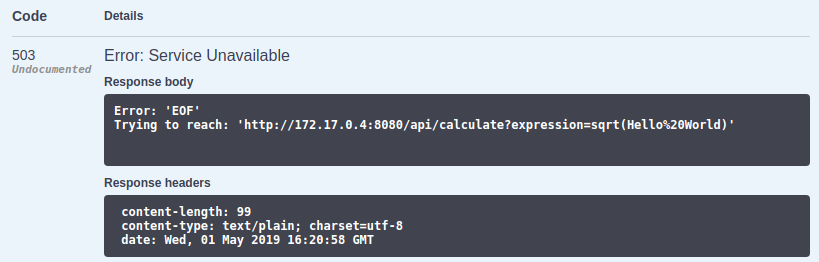

# Start the First Pod

Now we are prepared to start our first pod.

## Create YAML file

In the current console tab we have still the `kubectl proxy` command running. We will use a second
console tab to run all further commands. Click on the `+` icon to add a second shell.

Create your first YAML file which will later on be used to create the first Kubernetes resource.

```bash
mkdir k8s-files
touch k8s-files/backend.yml
```

You can now edit the `backend.yml` using the Cloud Shell IDE above your shell.

## Write the pod definition

We will write the configuration of a pod to launch the backend. To get started copy the contents
of `kubernetes-workshop/k8s-examples/pod.yml` into your own `backend.yml`.

The example contains some values we need to change:

1. Set the name of the pod to `calculator-backend`.
2. Change the image of the container to `quay.io/kubernetes-workshop/calculator-backend:v1`.
3. The backend service does run on port `8080` change this in the configuration.

The resources definition is also fine for our service.

## Apply the pod definition

The CLI for Kubernetes allows us to send all configuration files of a directory to Kubernetes.

```
kubectl apply -f k8s-files/
```

The console should display the following:

```
pod "calculator-backend" created
```

## Monitor the startup

You can now monitor the startup of the pod with `kubectl get pods -w`. The flag `-w` enables the
watch mode on every update the console is updated with the new pod state.

You can exit the watch mode with `ctrl-c`.

The output can be seen as follows:

```
NAME                 READY     STATUS              RESTARTS  AGE
calculator-backend   0/1       Pending             0         0s
calculator-backend   0/1       Pending             0         0s
calculator-backend   0/1       ContainerCreating   0         0s
calculator-backend   1/1       Running             0         3s
```

## Access the pod

You can now use the proxy we set up previously to access the pod.

Use the [link]($GCLOUD_SHELL_URL/api/v1/namespaces/default/pods/calculator-backend/proxy/) to access the pod:

```
$GCLOUD_SHELL_URL/api/v1/namespaces/default/pods/calculator-backend/proxy/
```

The browser should now display the Swagger UI of the backend service.

## Execute a calculation

To run your calculation against the API you can use the Swagger UI.

1. Click on `GET /calculate`
2. Click on `Try it out` on the right side
3. Enter a expression into the field, e.g. `100 * sqrt(3)`
4. Click on `Execute`
5. The UI displays the response below:
   

## Trigger an error

The service does not handle invalid expressions well. It crashes when an invalid expression is entered.

1. Verify that the pod is still running: `kubectl get pods`
2. The output should look like this:
   ```
   NAME                 READY     STATUS    RESTARTS   AGE
   calculator-backend   1/1       Running   0          7m
   ```
3. Execute an invalid expression, e.g. `sqrt(Hello World)`
4. The UI displays the error:
   
5. Try a valid expression, there will still be an error.
