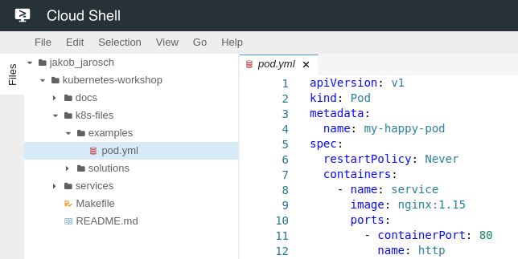

# Setup your account

Before we can begin with launching our first Kuberentes workloads we need to setup our development environment.

## Open your Google Cloud project

The project in Google Cloud contains all the resources you will create during the workshop. This includes the Kubernetes cluster, load balancers, etc.

1. Open the [Cloud Console](https://console.cloud.google.com)
2. Login with your Google account used for registration
3. Find your personal project for the workshop (`k8s-workshop-[0-9]+`)
4. Enter your project id below, this will customize the tutorial<br>
   <input id="gcloud-project-id"> <button id="gcloud-project-id-apply">Apply</button>

## Start Cloud Shell

The Cloud Shell is a browser based IDE and command line that can be used to execute shell commands inside your project.
The shell has pre-installed all tools required to launch Kubernets workloads.

1. Open the [Cloud Shell](https://console.cloud.google.com/cloudshell/editor?project=$GCLOUD_PROJECT_ID) in a new Tab
2. Run `gcloud config get-value project` this should return `$GCLOUD_PROJECT_ID`.
3. Clone our workshop repository
   ```bash
   git clone https://github.com/meisterplan/kubernetes-workshop.git
   ```
4. You should see the repository with its directories in the upper screen
   
5. During the workshop we will focus on the `k8s-files` directory in the repository

## Setup your Kubernetes cluster

We have to create a Kubernetes cluster that we will interact with during the tutorial.
We will create a Kubernetes cluster v1.11 with one node per zone in the region Frankfurt.
Follow the guide to get it started.

1. Run the following command to create your cluster:
   ```
   gcloud container clusters create my-cluster --region europe-west3 --cluster-version 1.11.8-gke.6 --num-nodes 1
   ```
2. The output should look like the following:
   ```
   first_last@cloudshell:~ ($GCLOUD_PROJECT_ID)$ gcloud container clusters create my-cluster --region europe-west3 --cluster-version 1.11.8-gke.6 --num-nodes 1
   WARNING: ...truncated some lines...
   Creating cluster my-cluster in europe-west3... Cluster is being health-checked (master is healthy)...done.
   Created [https://container.googleapis.com/v1/projects/$GCLOUD_PROJECT_ID/zones/europe-west3/clusters/my-cluster].
   To inspect the contents of your cluster, go to: https://console.cloud.google.com/kubernetes/workload_/gcloud/europe-west3/my-cluster?project=$GCLOUD_PROJECT_ID
   kubeconfig entry generated for my-cluster.
   NAME        LOCATION      MASTER_VERSION  MASTER_IP     MACHINE_TYPE   NODE_VERSION  NUM_NODES  STATUS
   my-cluster  europe-west3  1.11.8-gke.6    35.234.67.59  n1-standard-1  1.11.8-gke.6  3          RUNNING
   ```
3. Test if you can access your cluster with `kubectl cluster-info`.<br>
   This should return some similar output:
   ```
   Kubernetes master is running at https://35.234.67.59
   GLBCDefaultBackend is running at https://35.234.67.59/api/v1/namespaces/kube-system/services/default-http-backend:http/proxy
   Heapster is running at https://35.234.67.59/api/v1/namespaces/kube-system/services/heapster/proxy
   KubeDNS is running at https://35.234.67.59/api/v1/namespaces/kube-system/services/kube-dns:dns/proxy
   Metrics-server is running at https://35.234.67.59/api/v1/namespaces/kube-system/services/https:metrics-server:/proxy
   ```
4. You can also find your Kubernetes cluster in the [Console](https://console.cloud.google.com/kubernetes/clusters/details/europe-west3/my-cluster?project=$GCLOUD_PROJECT_ID)

Now you are ready to [start](02-first-pod.md) with the tutorial.
